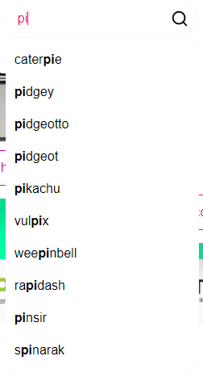
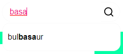

# CAMPO DE BUSCA

Para o campo de busca, decidiu-se pelo foco na busca pelos nomes do Pokémons. Neste componente, conforme for digitando, é realizado um filtro nos Pokémons que são retornados para o usuário (Figura 1 e Figura 2), onde é retornado o nome do Pokémon desejado.

Figura 1



Figura 2



Para a consulta dos dados sobre os Pokémons, foi utilizado o Cliente HTTP Axios que tem por objetivo, buscar as informações sobre os produtos por meio do método HTTP GET, onde as informações são armazenadas em uma variável e apresentados na caixa de pesquisa (`./src/components/Header/Search/index.tsx`), conforme explicitado acima.

Para instalar o Axios, execute:

`npm install axios` ou `yarn add axios`

Após pesquisar e selecionar o Pokémon desejado no campo de pequisa, o usuário é redirecionado para outra página, onde são apresentadas informações mais detalhadas sobre o Pokémon, como nome, identificados, peso, altura, habilidades entre outras informações. Ainda nesta página, é permitido ao usuário clicar nos botões de habilidades, para abrir o modal, onde são apresentados detalhes sobre cada uma das habilidades, sendo possível navegar entre as habilidades e descobrir quais Pokémons a compartilham.

Para que isso fosse possível, na página relacioandas aos Pokémons (`./src/page/pokemon/[name].tsx`, onde `[name]` refere-se ao nome dos Pokémons, sendo esta uma rota dinâmica), foi implementado o getStaticPaths que permitiu a dinamicidade das rotas, ao buscar os nomes de todos os Pokémons e armazená-los em uma lista. Logo abaixo, foi feita a implementação do getStaticProps, para a busca e apresentação dos dados sobre o Pokémon desejado. O getStaticProps, foi escolhido em detrimento getServerSideProps, devido à estaticidade dos dados da API, como são dados que dificilmente sofrerão alterações, o getStaticProps será suficiente.

Após buscar as informações sobre o Pokémon, os dados foram devidamente organizados com o auxílio do TypeScript e retornados para o componente, onde foram apresentados para o usuário.

---

This is a [Next.js](https://nextjs.org/) project bootstrapped with [`create-next-app`](https://github.com/vercel/next.js/tree/canary/packages/create-next-app).

## Getting Started

First, run the development server:

```bash
npm run dev
# or
yarn dev
```

Open [http://localhost:3000](http://localhost:3000) with your browser to see the result.

You can start editing the page by modifying `pages/index.tsx`. The page auto-updates as you edit the file.

[API routes](https://nextjs.org/docs/api-routes/introduction) can be accessed on [http://localhost:3000/api/hello](http://localhost:3000/api/hello). This endpoint can be edited in `pages/api/hello.ts`.

The `pages/api` directory is mapped to `/api/*`. Files in this directory are treated as [API routes](https://nextjs.org/docs/api-routes/introduction) instead of React pages.

## Learn More

To learn more about Next.js, take a look at the following resources:

- [Next.js Documentation](https://nextjs.org/docs) - learn about Next.js features and API.
- [Learn Next.js](https://nextjs.org/learn) - an interactive Next.js tutorial.

You can check out [the Next.js GitHub repository](https://github.com/vercel/next.js/) - your feedback and contributions are welcome!

## Deploy on Vercel

The easiest way to deploy your Next.js app is to use the [Vercel Platform](https://vercel.com/new?utm_medium=default-template&filter=next.js&utm_source=create-next-app&utm_campaign=create-next-app-readme) from the creators of Next.js.

Check out our [Next.js deployment documentation](https://nextjs.org/docs/deployment) for more details.
